# JD 特定人群生理孪生与医疗保障大模型平台
## 多源图文医疗 RAG 子系统总体功能与技术规划 V0.1

> **文档性质：** 总体功能规划 / 技术架构设计 / 开发路线基线  
> **版本：** V0.1  
> **日期：** 2026-08-13  
> **当前目标：** 不实现“大平台”的全部能力，只实现其中与 RAG 最相关、能够独立运行和演示的“多源图文医疗知识增强检索子系统”。  
> **开发原则：** 面向真实生产架构设计；V1 必须可完整运行、可评估、可部署；V2/V3 保留真实院内系统和真实数据接入能力。  
> **学习原则：** 每个开发阶段同步覆盖《AI 大模型企业面试题》中的相关问题，做到“开发一个模块，吃掉一组面试题”。

---

# 1. 项目背景

原始项目“JD 特定人群生理孪生与医疗保障大模型平台”涉及多源医疗数据、本体构建、医疗保障大模型、安全对齐、临床可信度评估等多个部分。

本子项目主要承接原需求中与 RAG 最直接相关的两类任务：

1. **多源异构医疗数据标注与本体构建**
   - 非结构化病历
   - 体检报告
   - 影像报告
   - 症状、指标、疾病实体抽取
   - 因果及其他医学关系抽取
   - 动态本体库构建

2. **多源医疗数据医学标注与本体审核**
   - 鉴别诊断依据结构化
   - 治疗方案调整原因结构化
   - 语义关系审核
   - 知识库准确性保障

原始项目还包含大模型安全对齐和临床专家双盲验证。V1 不复制真实临床实验，而是将其中的思想转化为：
- RAG 安全边界
- 答案证据引用
- 自动化评测
- 人工审核接口
- 错误类型统计

---

# 2. 子项目最终定位

## 2.1 项目名称

**JD 特定人群生理孪生与医疗保障大模型平台 —— 多源图文医疗知识增强检索子系统**

英文工作名：

**Patient-Centric Multimodal Medical RAG**

## 2.2 一句话定义

面向医生与医疗保障工作人员，将患者多年分散在病历、体检、检验、用药及带图片检查报告中的信息统一结构化，并结合医学知识库，通过 Hybrid RAG、时间检索和医学本体检索，为医生提供**可追溯、可引用、面向患者纵向健康档案的智能检索与辅助总结能力**。

## 2.3 核心用户

### 主要用户
- 保健科医生
- 临床医生
- 专病医生

### 次要用户
- 健康管理人员
- 医疗保障工作人员
- 医学知识库维护人员
- 系统管理员

## 2.4 明确不做

V1 不做以下能力：

- 不直接生成最终临床诊断
- 不自动开药
- 不替代医生做治疗决策
- 不处理完整 MRI/CT/OCT DICOM 三维序列
- 不训练医学影像分割/检测模型
- 不宣称经过真实临床验证
- 不使用未经授权的真实患者隐私数据

V1 处理的是：

> **病历 + 检验数据 + 体检报告 + 图文混排检查报告 + 医学知识**

---

# 3. 产品目标

系统最终需要回答五类问题。

## 3.1 单患者事实查询

示例：

> 该患者最近一次 LDL-C 是多少？

## 3.2 患者纵向时间分析

示例：

> 该患者过去三年的血压有什么变化？

## 3.3 跨文档关联查询

示例：

> 2025 年调整降压药前后，患者的血压和相关指标有什么变化？

## 3.4 图文检查报告查询

示例：

> 最近两次 OCT / UBM 报告分别有哪些主要变化？对应检查图片在哪里？

## 3.5 患者事实 + 医学知识联合查询

示例：

> 该患者多次出现 LDL-C 偏高，需要重点关注哪些相关风险因素？请同时给出患者依据与医学知识依据。

---

# 4. 总体业务流程

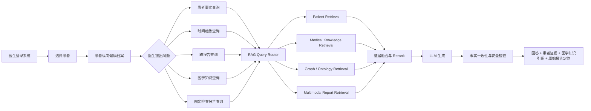

---

# 5. 总体系统架构

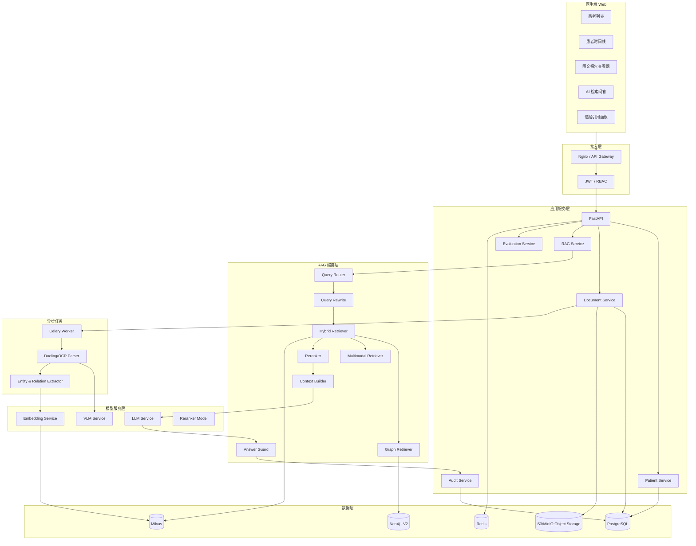

---

# 6. 数据设计

系统不假设一开始拥有真实医院患者数据。

V1 使用三层数据。

## 6.1 Patient Data：患者纵向事实数据

主要来源：

- Synthea 合成纵向健康记录
- 自建模拟患者病例
- 后续可替换为经过合规授权的院内脱敏数据 Adapter

主要数据：

- Patient
- Encounter
- Condition
- Observation
- Medication
- Procedure
- DiagnosticReport
- ImagingStudy Metadata

## 6.2 Medical Report：医疗报告文件

为了真实模拟医院环境，系统故意保留多种格式：

```text
patient_000001/
├── demographics.json
├── outpatient_2024_01.pdf
├── physical_exam_2024_05.pdf
├── laboratory_2024_06.xlsx
├── medication_2024_07.csv
├── oct_report_2025_02.pdf
├── ubm_report_2025_06.pdf
├── mri_report_2025_09.pdf
└── discharge_summary_2026_01.docx
```

重点不是伪造 MRI/OCT 原始三维数据，而是构造真实工作中常见的：

**图文混排检查报告**

包含：

- 患者信息
- 检查类型
- 检查日期
- 左/右侧
- 关键检查图片
- 表格/测量值
- 检查所见
- 医生结论

## 6.3 Medical Knowledge：医学知识

来源类型：

- 公开临床指南
- 公开专家共识
- 公开疾病知识文档
- 药品说明书
- 合规公开医学资料

知识库中的知识必须记录：

```text
source
title
organization
publish_date
version
section
page
url/file
effective_date
```

用于保证答案可引用。

---

# 7. 数据生成与模拟流程

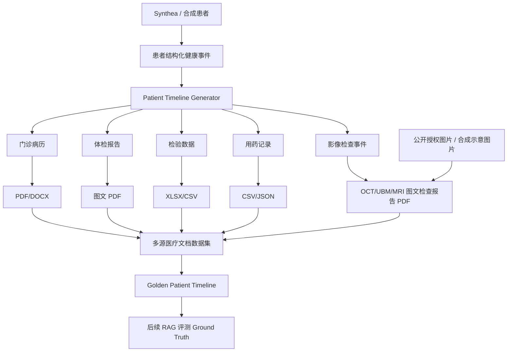

**重要原则：**

生成模拟报告时，先生成结构化 Ground Truth，再渲染成 PDF/Excel/Word。

因此系统永远保留：

> 原始真值 → 文档 → 解析结果

这使得我们可以真正计算文档解析准确率，而不是只凭肉眼判断。

---

# 8. 多模态医疗报告处理

## 8.1 处理目标

| 数据类型 | 示例 | V1 处理方式 |
|---|---|---|
| 普通文本 | 门诊病历 | 文本抽取 |
| 扫描文本 | 扫描 PDF | OCR |
| 表格 | 检验结果 | Table Parsing |
| 图片 | OCT/UBM/MRI 报告截图 | 图片提取 |
| 图注 | 检查图说明 | 版面关联 |
| 图片语义 | 检查区域/检查类型 | VLM Caption |
| 测量值 | 表格/图中数值 | OCR + 结构化抽取 |
| 原始 DICOM | MRI/OCT volume | V1 不处理 |

## 8.2 图文 PDF 解析流程

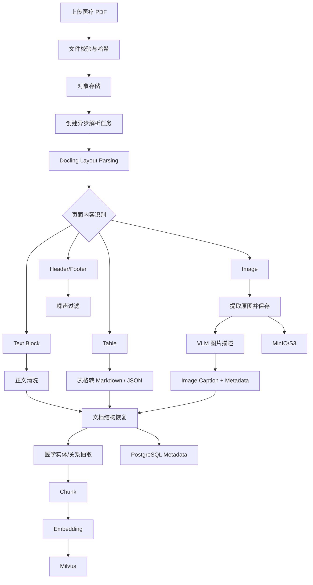

## 8.3 图片处理边界

V1 中 VLM 负责：

- 图像类型识别
- 检查部位/检查类型识别
- 图片内容概括
- 图像与报告段落绑定
- 图中文字/标签辅助抽取
- 为图像生成可检索 Caption

V1 中 VLM **不负责**：

- 独立做最终诊断
- 精确病灶分割
- 替代影像科医生
- 对 DICOM 序列进行三维诊断

## 8.4 多模态数据记录格式

```json
{
  "patient_id": "P000123",
  "report_id": "R20260518001",
  "document_type": "UBM_REPORT",
  "exam_date": "2026-05-18",
  "page": 1,
  "content_type": "image",
  "image_uri": "s3://medical-rag/p000123/...",
  "caption": "右眼 UBM 检查图，展示前房角及虹膜区域...",
  "linked_text_block_ids": ["blk_0012", "blk_0013"],
  "source_file": "ubm_report_20260518.pdf"
}
```

---

# 9. 文档 Chunk 设计

不采用“一刀切固定 Token”作为唯一方案。

## 9.1 Chunk 类型

### Narrative Chunk
用于：
- 门诊记录
- 出院记录
- 检查所见

### Table Chunk
完整保留：
- 检验项目
- 数值
- 单位
- 参考范围
- 异常标记

### Report Section Chunk
按照：
- 检查所见
- 影像结论
- 诊断意见

切分。

### Image Caption Chunk
图片 Caption 与：
- patient_id
- report_id
- exam_date
- page
- linked_text

绑定。

### Timeline Event Chunk
将同一就诊事件内的多源内容聚合。

## 9.2 Chunk 流程

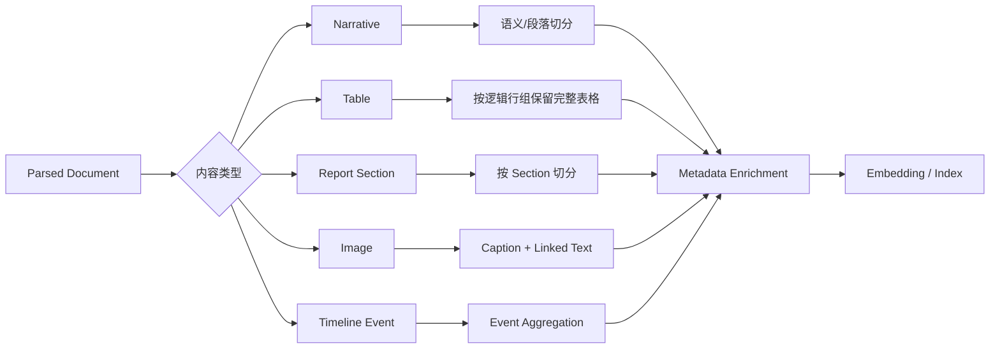

## 9.3 每个 Chunk 必须保存的 Metadata

```text
chunk_id
patient_id
document_id
document_type
department
exam_type
exam_date
event_date
body_part
laterality
content_type
page
section
source_uri
source_hash
version
```

这是后续 Metadata Filtering 的基础。

---

# 10. Patient Timeline 设计

患者数据不能只作为“很多独立 Chunk”。

系统需要显式构建患者时间线。

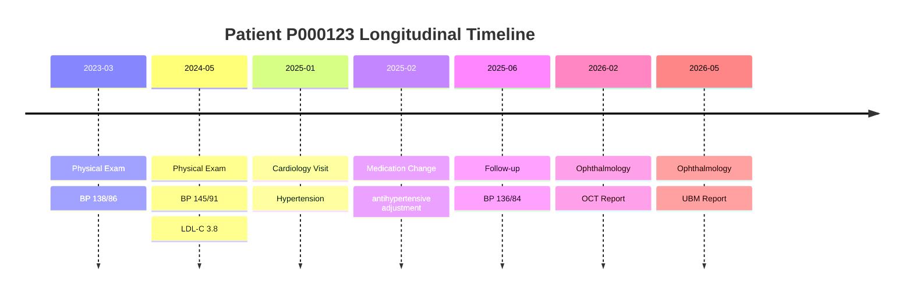

内部 Event Schema：

```json
{
  "event_id": "E001",
  "patient_id": "P000123",
  "event_time": "2026-05-18",
  "event_type": "IMAGING_EXAM",
  "department": "Ophthalmology",
  "entities": [],
  "documents": [],
  "observations": [],
  "medications": []
}
```

时间查询首先经过 Timeline Service，而不是简单向量召回。

---

# 11. 医学本体 / Knowledge Graph

## 11.1 为什么需要本体

原始业务并不是只存文档，而是涉及：

- 症状
- 指标
- 疾病
- 药物
- 检查
- 因果/相关关系
- 鉴别诊断依据
- 治疗调整原因

因此 V2 引入知识图谱。

## 11.2 核心实体

```text
Patient
Disease
Symptom
Indicator
Medication
Examination
Procedure
RiskFactor
MedicalDocument
ClinicalGuideline
```

## 11.3 核心关系

```text
Patient --HAS_DISEASE--> Disease
Patient --HAS_SYMPTOM--> Symptom
Patient --HAS_INDICATOR--> Indicator
Patient --TAKES--> Medication
Patient --UNDERWENT--> Examination
Disease --ASSOCIATED_WITH--> Indicator
Disease --HAS_RISK_FACTOR--> RiskFactor
Medication --TREATS--> Disease
MedicalDocument --MENTIONS--> Entity
ClinicalGuideline --SUPPORTS--> KnowledgeClaim
```

## 11.4 本体构建流程

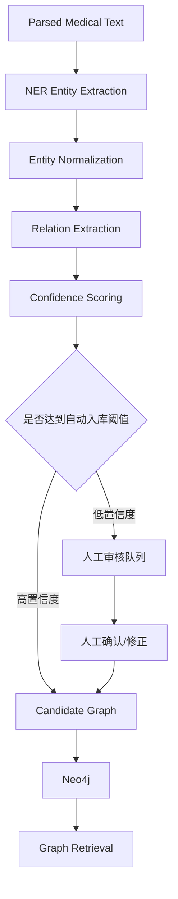

---

# 12. RAG 检索主链路

这是项目最核心的技术部分。

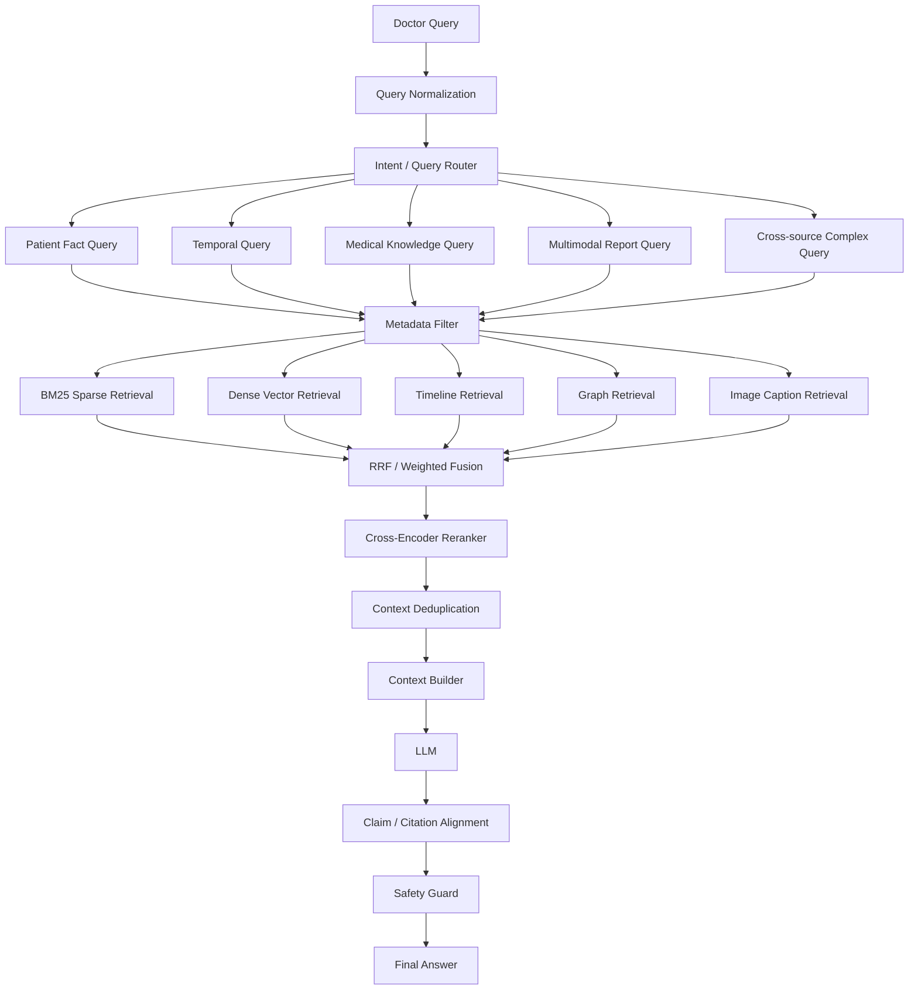

---

# 13. Query Router 设计

Query Router 负责识别：

```text
patient_fact
patient_timeline
patient_comparison
medical_knowledge
report_lookup
multimodal_report
patient_plus_knowledge
```

示例：

> “这个患者 2024 年到 2026 年血压有什么变化？”

路由：

```text
patient_timeline
patient_id = P000123
time_range = 2024-01-01 ~ 2026-12-31
entities = [blood_pressure]
```

然后系统优先：
1. Timeline Retrieval
2. Structured Observation Query
3. Document Retrieval

而不是只做向量搜索。

---

# 14. Hybrid Retrieval 设计

## 14.1 Dense Retrieval

负责：
- 语义相似
- 同义表达
- 医学描述匹配

## 14.2 BM25 / Sparse Retrieval

负责：
- 专有名词
- 医学缩写
- 数字/代码
- 药品名称
- 精确术语

## 14.3 Metadata Filter

例如：

```text
patient_id = P000123
exam_type = OCT
date >= 2025-01-01
laterality = RIGHT
```

## 14.4 Timeline Retrieval

处理：
- 最近一次
- 最近三年
- 调药前后
- 第一次出现异常
- 持续异常

## 14.5 Graph Retrieval

处理：
- 指标与疾病关系
- 症状与疾病关系
- 多跳关联
- 患者实体网络

## 14.6 Fusion

V1：

```text
BM25 + Dense → RRF
```

V2：

```text
BM25 + Dense + Graph + Timeline → Weighted/RRF Fusion
```

再进入 Cross-Encoder Reranker。

---

# 15. Reranker 设计

召回：

```text
Top 50 ~ 100
```

Rerank：

```text
Top 10 ~ 20
```

最终进入 Context：

```text
Top 5 ~ 10
```

具体 Top-K 不写死，通过 Evaluation Dataset 调优。

需要记录：

```text
retrieval_score
fusion_score
rerank_score
source_type
rank_before
rank_after
```

方便后续回答面试题：

> Reranker 为什么有效？  
> 多路召回怎么融合？  
> Top-K 怎么确定？

---

# 16. Context Builder

医疗 RAG 不允许简单：

```python
"\n".join(chunks)
```

需要构建有结构的上下文。

示例：

```text
[患者事实]
2025-01-10 心内科门诊...
2025-02-15 用药调整...
2025-06-20 复查血压...

[检查报告]
2026-05-18 UBM...
图片：report_001_page1_img2

[医学知识]
指南 A，第 X 节...
指南 B，第 Y 页...
```

按：

1. 患者事实
2. 时间关系
3. 报告内容
4. 图片语义
5. 医学知识

分区，减少上下文混淆。

---

# 17. Answer Generation 与 Citation

LLM 输出必须是 Evidence-First。

示例：

```text
结论：
患者近一年血压整体较前期改善，但仍存在波动。

患者依据：
[患者记录 P000123 / 2025-06-20 / 随访]
[患者记录 P000123 / 2026-02-10 / 体检]

医学知识依据：
[某临床指南 / 第 X 节 / 第 X 页]
```

每个引用都能够跳转到：
- 原文
- 原 PDF 页码
- 原始表格
- 原始检查图片

---

# 18. 安全设计

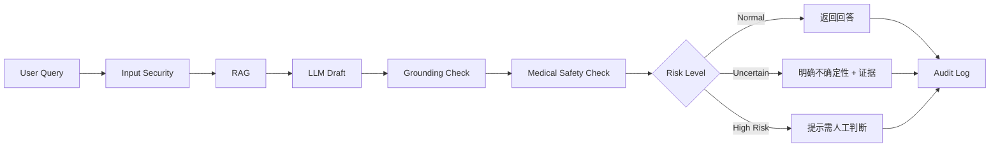

## 18.1 安全规则

- 不生成“确定诊断”式措辞
- 不自动开药
- 不隐藏证据来源
- 无证据时必须允许回答“不足以判断”
- 高风险问题提示人工专业判断
- 回答只允许引用当前用户有权限查看的患者数据
- 日志中进行敏感字段脱敏
- 对真实患者数据禁止无授权发送至外部模型 API

---

# 19. 权限与审计

## 19.1 RBAC

角色：

```text
ADMIN
DOCTOR
HEALTH_MANAGER
KNOWLEDGE_EDITOR
AUDITOR
```

## 19.2 Patient Scope

不能只做“登录后能看到所有患者”。

必须支持：

```text
User → Department → Patient Scope
```

## 19.3 Audit Log

记录：

```text
user_id
patient_id
query
retrieved_documents
model
prompt_version
answer
citations
latency
token_usage
timestamp
```

真实环境中出现问题后必须能够追溯。

---

# 20. 数据库与存储设计

## 20.1 PostgreSQL

主要表：

```text
users
roles
user_roles
patients
patient_access
encounters
observations
conditions
medications
procedures
documents
document_pages
document_blocks
medical_images
timeline_events
knowledge_sources
rag_queries
rag_retrieval_logs
rag_answers
audit_logs
evaluation_cases
evaluation_runs
```

## 20.2 Milvus

Collections：

```text
patient_document_chunks
medical_knowledge_chunks
image_caption_chunks
```

## 20.3 Redis

用于：

- Session
- Query Cache
- Hot Patient Cache
- Task Status
- Rate Limit
- Distributed Lock

## 20.4 Object Storage

MinIO / S3：

```text
raw/
parsed/
images/
reports/
exports/
```

## 20.5 Neo4j

V2 启用：

```text
medical_ontology
patient_entity_graph
```

---

# 21. 后端 API 规划

统一前缀：

```text
/api/v1
```

## 21.1 Authentication

```text
POST /auth/login
POST /auth/refresh
GET  /auth/me
```

## 21.2 Patient

```text
GET /patients
GET /patients/{patient_id}
GET /patients/{patient_id}/timeline
GET /patients/{patient_id}/reports
```

## 21.3 Document

```text
POST /documents/upload
GET  /documents/{document_id}
GET  /documents/{document_id}/parse-status
GET  /documents/{document_id}/blocks
GET  /documents/{document_id}/images
```

## 21.4 RAG

```text
POST /rag/query
POST /rag/query/stream
GET  /rag/history
GET  /rag/query/{query_id}/evidence
```

## 21.5 Evaluation

```text
POST /evaluation/run
GET  /evaluation/runs
GET  /evaluation/runs/{run_id}
```

## 21.6 Admin

```text
GET  /admin/audit
POST /admin/reindex
POST /admin/knowledge/upload
```

---

# 22. 前端功能规划

医生 PC Web：

```text
┌─────────────────────────────────────────────────────────────────┐
│ Patient-Centric Medical RAG                                    │
├──────────────┬──────────────────────────┬───────────────────────┤
│ 患者列表      │ 患者档案 / Timeline      │ AI Assistant          │
│              │                          │                       │
│ 张某          │ 2024 体检               │ 医生问题               │
│ 李某          │ 2025 心内科             │                       │
│ 王某          │ 2025 用药调整           │ AI 回答                │
│              │ 2026 OCT                │                       │
│              │ 2026 UBM                │ Evidence              │
│              │                          │ [原报告] [指南]        │
├──────────────┴──────────────────────────┴───────────────────────┤
│ 当前报告查看器：PDF / 图片 / 表格 / 高亮引用                    │
└─────────────────────────────────────────────────────────────────┘
```

核心页面：

1. 登录
2. 患者列表
3. 患者详情
4. Patient Timeline
5. 医疗报告查看器
6. AI 问答
7. Evidence 面板
8. 知识库管理
9. Evaluation Dashboard
10. Audit Dashboard

---

# 23. RAG Evaluation

不能以“看起来回答不错”作为项目结果。

建立独立 Evaluation Dataset。

## 23.1 Question 分类

建议 V1：

```text
300 Questions
```

分为：

```text
Q1 单文档事实
Q2 结构化数据查询
Q3 跨文档事实
Q4 时间推理
Q5 图文报告
Q6 医学知识
Q7 患者事实 + 医学知识
Q8 不可回答 / Negative Sample
```

## 23.2 Retrieval Metrics

```text
Hit Rate@K
Recall@K
Precision@K
MRR
NDCG
```

## 23.3 Generation Metrics

```text
Faithfulness
Answer Relevance
Context Precision
Context Recall
Factual Correctness
Citation Accuracy
```

## 23.4 多模态专项指标

```text
Image Retrieval Hit Rate
Image-Report Alignment Accuracy
Caption Key-Information Recall
```

## 23.5 系统工程指标

```text
P50 / P95 Latency
TTFT
Total Response Time
QPS
Token Usage
Retrieval Latency
Rerank Latency
```

---

# 24. Evaluation 流程

```mermaid
flowchart TD
    A[Golden Dataset] --> B[Run RAG Pipeline]
    B --> C1[Retrieval Result]
    B --> C2[Generated Answer]
    B --> C3[Citations]
    B --> C4[Latency/Token]

    C1 --> D1[Recall@K / MRR / NDCG]
    C2 --> D2[Faithfulness / Relevance]
    C3 --> D3[Citation Accuracy]
    C4 --> D4[P50 / P95 / TTFT]

    D1 --> E[Evaluation Report]
    D2 --> E
    D3 --> E
    D4 --> E

    E --> F[A/B Compare]
    F --> G[Chunk / Embedding / Retrieval / Rerank 参数迭代]
    G --> B
```

---

# 25. 模型服务规划

## V1

模型层全部做成 Provider Interface：

```python
LLMProvider
EmbeddingProvider
VisionLanguageProvider
RerankerProvider
```

允许开发阶段使用：
- 外部 API
- 本地模型

但患者数据使用合成数据。

## V2

引入本地部署：

```text
vLLM
```

提供 OpenAI-compatible API。

测量：
- TTFT
- TPOT
- Throughput
- GPU Memory
- Concurrent Requests

因此后续面试中的 vLLM 部署问题可以直接基于本项目回答。

---

# 26. 异步任务设计

文档上传不能在 HTTP 请求中同步完成所有工作。

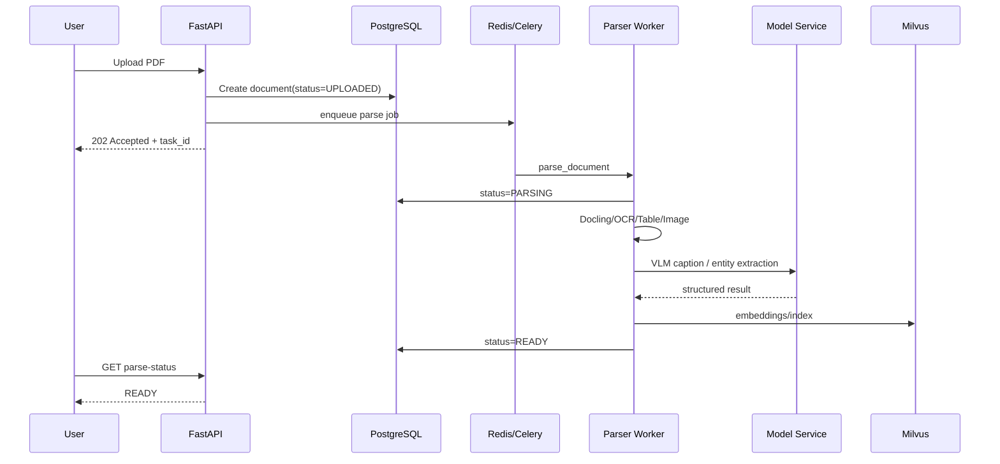

---

# 27. 可观测性

生产环境需要能够回答：

> 哪个步骤慢？  
> 哪个 Retriever 出错？  
> 为什么这次回答错？  
> 调了什么模型？  
> 使用了哪些 Chunk？

因此记录 Trace：

```text
request_id
query_id
user_id
patient_id
router_result
rewrite_query
metadata_filter
retrieved_chunks
scores
reranked_chunks
prompt_version
model_version
answer
citations
latency_per_stage
token_usage
error
```

技术方案：

- Python structured logging
- OpenTelemetry
- Prometheus
- Grafana
- 可选 Langfuse / LangSmith

---

# 28. 开发与生产环境

## 28.1 本地开发

```text
Docker Compose
```

运行：

```text
frontend
api
worker
postgres
redis
milvus
minio
neo4j(optional)
model-service(optional)
```

## 28.2 测试服务器

```text
Nginx
Docker Compose
GPU Model Service
Persistent Volume
```

## 28.3 正式生产扩展

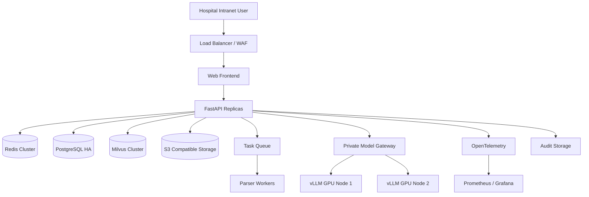

真正院内部署时再扩展：
- Kubernetes
- PostgreSQL HA
- Milvus Cluster
- Redis Cluster
- GPU Model Pool
- PACS/HIS/LIS/FHIR Adapter

---

# 29. 与真实医院系统的未来对接

当前 V1 不直接连接医院。

但必须提前定义 Adapter：

```text
FHIRAdapter
HISAdapter
LISAdapter
PACSReportAdapter
FileImportAdapter
```

未来真实数据进入后，统一转换到 Internal Clinical Schema。

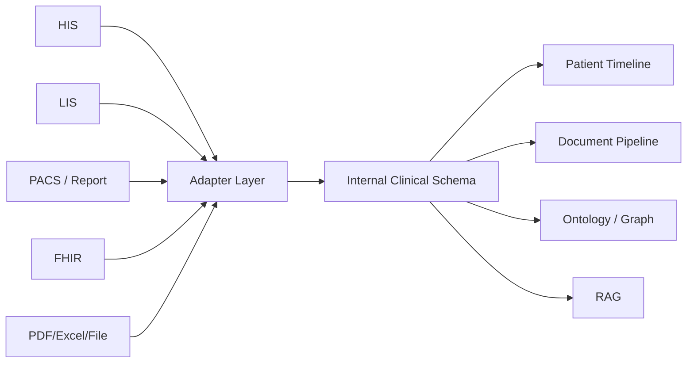

因此系统不会绑定死在 Synthea。

---

# 30. 项目目录建议

```text
medical-rag/
├── apps/
│   ├── api/
│   ├── worker/
│   └── web/
├── src/
│   ├── auth/
│   ├── patients/
│   ├── documents/
│   ├── parsing/
│   ├── multimodal/
│   ├── chunking/
│   ├── embedding/
│   ├── retrieval/
│   ├── reranking/
│   ├── graph/
│   ├── rag/
│   ├── evaluation/
│   ├── models/
│   └── observability/
├── data/
│   ├── synthetic/
│   ├── knowledge/
│   └── eval/
├── migrations/
├── tests/
│   ├── unit/
│   ├── integration/
│   ├── retrieval/
│   └── e2e/
├── deployment/
│   ├── docker/
│   └── k8s/
├── docs/
├── scripts/
├── docker-compose.yml
├── pyproject.toml
└── README.md
```

---

# 31. 测试体系

必须有：

## Unit Test
- Chunk
- Metadata
- Query Parser
- Citation Parser

## Integration Test
- PostgreSQL
- Redis
- Milvus
- Object Storage

## Retrieval Test
- Dense
- BM25
- Hybrid
- Reranker

## Multimodal Test
- PDF 图片提取
- Caption
- 图片与文本绑定

## E2E

```text
Upload → Parse → Index → Query → Citation
```

---

# 32. CI/CD

开发流程：

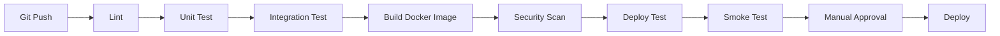

建议：

```text
GitHub Actions / GitLab CI
Ruff
Pytest
Docker
Alembic
```

---

# 33. 开发阶段规划

## Phase 0：工程骨架与数据基线

目标：

- Git 工程初始化
- Docker Compose
- FastAPI
- PostgreSQL
- Redis
- MinIO
- Synthea 数据生成
- Patient Schema
- Patient Timeline

交付：

```text
患者可以导入
患者可以查看
时间线可以显示
```

---

## Phase 1：多源文档解析

实现：

- PDF
- DOCX
- XLSX
- CSV
- JSON
- Docling
- OCR
- Table Parsing
- 图片提取

交付：

```text
一份图文 UBM/OCT PDF
→
文本 + 表格 + 图片 + Metadata
```

---

## Phase 2：基础 RAG

实现：

- Chunk
- Embedding
- Milvus
- Dense Retrieval
- Citation

交付：

```text
患者文档问答
医学知识问答
```

---

## Phase 3：Hybrid RAG

实现：

- BM25
- Dense
- Metadata Filtering
- RRF
- Reranker
- Query Rewrite

交付：

```text
Hybrid Search A/B Evaluation
```

---

## Phase 4：Patient-Centric RAG

实现：

- Timeline Retrieval
- Patient Scope
- Temporal Query
- Cross-document Query
- Patient + Knowledge Context Builder

交付：

```text
跨年度患者问题
调药前后问题
异常趋势问题
```

---

## Phase 5：Multimodal RAG

实现：

- Report Image Extraction
- VLM Caption
- Image Metadata
- Text/Image Linked Retrieval
- Image Evidence UI

交付：

```text
UBM/OCT 图文报告查询
```

---

## Phase 6：Ontology / GraphRAG

实现：

- Entity Extraction
- Relation Extraction
- Entity Normalization
- Neo4j
- Graph Retrieval

交付：

```text
Vector + Graph 混合医疗检索
```

---

## Phase 7：Evaluation

实现：

- 300 条 Evaluation Dataset
- Recall@K
- MRR
- NDCG
- Faithfulness
- Context Precision/Recall
- Citation Accuracy
- A/B Dashboard

交付：

```text
可量化 RAG Evaluation Report
```

---

## Phase 8：生产工程化

实现：

- JWT
- RBAC
- Patient Scope
- Audit
- Async Task
- Redis Cache
- Streaming API
- Observability
- Docker Deployment

交付：

```text
完整可部署系统
```

---

## Phase 9：本地模型与性能测试

实现：

- vLLM
- Local LLM
- 并发测试
- TTFT
- TPOT
- GPU Memory
- Throughput

交付：

```text
Model Serving Benchmark
```

---

# 34. 面试题同步学习映射

项目开发与面试复习必须绑定。

| 开发阶段 | 对应题库模块 | 重点问题 |
|---|---|---|
| Phase 0 | M01 / M18 / M20 | 项目架构、数据库、Python |
| Phase 1 | M05 / M21 | PDF、表格、OCR、图片如何处理 |
| Phase 2 | M04 / M06 | RAG Pipeline、Embedding、Milvus |
| Phase 3 | M07 | BM25、Hybrid、RRF、Reranker、Query Rewrite |
| Phase 4 | M08 / M12 | RAG 质量、上下文、长时序数据 |
| Phase 5 | M21 | 多模态、图片、复杂 PDF |
| Phase 6 | M22 / M08 | Knowledge Graph、GraphRAG |
| Phase 7 | M08 / M13 | RAG/Agent Evaluation |
| Phase 8 | M17 / M18 / M19 | FastAPI、Redis、Docker、部署 |
| Phase 9 | M16 | vLLM、并发、TTFT、TPOT、显存 |

另外：

- M03 模型选型 / Prompt：贯穿 Phase 2~9
- M09 LangGraph：可在 Query Router / Workflow 中轻量引入
- M11 Tool Calling：后期将 Patient Search / Knowledge Search 封装为工具
- M14 LoRA：可作为附加实验，不作为 RAG 主链路强依赖

---

# 35. 项目最终能够覆盖的核心面试能力

完成全部阶段后，应能够基于真实代码回答：

### RAG
- RAG 端到端 Pipeline
- Chunk 选择
- Embedding 选型
- Vector DB 选型
- Milvus 索引
- BM25
- Hybrid Search
- RRF
- Reranker
- Query Rewrite
- Metadata Filter
- GraphRAG
- RAG Evaluation

### 多模态
- 复杂 PDF
- OCR
- 表格抽取
- 图片提取
- VLM
- 图片 Caption
- 图文绑定

### 工程化
- FastAPI
- async
- Streaming
- Redis
- PostgreSQL
- Object Storage
- Celery
- Docker
- Nginx
- CI/CD
- Observability

### 模型部署
- vLLM
- TTFT
- TPOT
- QPS
- 并发
- GPU 显存

### 项目设计
- 为什么这样设计
- 如何保证安全
- 如何评估
- 如何排障
- 如何扩展到真实医院

---

# 36. V1 最小可交付范围（必须控制）

为了避免项目无限膨胀，第一轮真正开发时只做：

```text
100~500 个合成患者
        +
多种格式患者记录
        +
UBM/OCT/体检图文 PDF
        +
医学知识库
        ↓
Docling / OCR / Image Extraction
        ↓
Chunk + Metadata
        ↓
BM25 + Dense
        ↓
RRF
        ↓
Reranker
        ↓
Patient Timeline Retrieval
        ↓
LLM
        ↓
Citation
        ↓
Evaluation
        ↓
Doctor Web UI
```

V1 不强制：

```text
Neo4j
Kubernetes
真实 HIS
真实 PACS
真实患者数据
LoRA
大规模分布式部署
```

这些全部保留接口，但不阻塞第一个完整版本。

---

# 37. V1 Definition of Done

只有满足以下条件才认为 V1 完成：

- [ ] 能导入 100+ 合成患者
- [ ] 能生成/导入多种医疗报告
- [ ] 至少包含一类图文混排 OCT/UBM 报告
- [ ] PDF/Word/Excel/CSV 可以解析
- [ ] 能抽取 PDF 图片
- [ ] 图片能够生成 Caption
- [ ] 能建立 Patient Timeline
- [ ] 能建立患者/知识双知识域
- [ ] Dense Retrieval 可用
- [ ] BM25 可用
- [ ] Hybrid Retrieval 可用
- [ ] RRF 可用
- [ ] Reranker 可用
- [ ] Metadata Filtering 可用
- [ ] 答案包含 Citation
- [ ] Citation 可以回到原始报告
- [ ] 至少有 100 条自动评测问题
- [ ] 有 Retrieval 指标
- [ ] 有 Generation 指标
- [ ] FastAPI 后端可用
- [ ] 医生 Web 界面可用
- [ ] Docker Compose 一键启动
- [ ] 有基本权限与 Audit Log
- [ ] 有 README / Architecture / API 文档
- [ ] 可以完整演示至少 5 类医疗问答场景

---

# 38. 关键技术选型 V0.1

| 层 | 推荐方案 | 说明 |
|---|---|---|
| Backend | FastAPI | Python 异步 API |
| Workflow | LangGraph（轻量使用） | Query Routing / 可持久化流程 |
| Parser | Docling | PDF/Office/Layout/Table/Image/OCR |
| OCR | Docling OCR Engine / 可替换 | 扫描报告 |
| VLM | Provider Interface | 图片 Caption |
| Embedding | BGE 系列 / 可替换 | 中文/多语医疗文本 |
| Vector DB | Milvus | Dense / Hybrid / Metadata |
| Sparse | BM25 | 精确医学术语 |
| Fusion | RRF | 多路召回融合 |
| Reranker | Cross Encoder | 精排 |
| Relational DB | PostgreSQL | 患者、文档、权限、审计 |
| Cache | Redis | Session / Cache / Queue |
| Object Store | MinIO/S3 | PDF、图片、解析产物 |
| Graph DB | Neo4j（V2） | Ontology / Graph Retrieval |
| Async | Celery | 文档解析异步任务 |
| Model Serving | vLLM（V2） | 本地 LLM 服务 |
| Frontend | Vue3 / React | 医生 PC Web |
| Reverse Proxy | Nginx | 网关 |
| Observability | OpenTelemetry + Prometheus/Grafana | Trace/Metrics |
| Deployment | Docker Compose → Kubernetes | 分阶段生产化 |

---

# 39. 技术选型原则

任何技术都不能因为“简历好看”而加入。

必须满足至少一个条件：

1. 当前业务确实需要
2. 能解决现有瓶颈
3. 能通过 A/B Evaluation 证明收益
4. 属于真实生产必须的工程能力
5. 为真实医院数据接入保留必要接口

例如：

- **Neo4j**：只有真正实现实体关系检索时加入
- **LangGraph**：只负责有状态 Query Workflow，不把普通函数强行改成 Agent
- **Redis**：必须承担真实缓存/状态任务，而不是“用了 Redis”但没有用途
- **vLLM**：只有本地部署模型时加入
- **Kubernetes**：V1 不强制

---

# 40. 当前最重要的设计结论

当前项目正式定性为：

> **一个医生使用的、面向纵向患者健康档案和图文检查报告的 Patient-Centric Multimodal RAG 系统。**

它不是：

> 上传几份 PDF 的普通知识库聊天机器人。

核心差异为：

```text
Patient Timeline
+
Heterogeneous Medical Documents
+
Multimodal Reports
+
Hybrid Retrieval
+
Medical Knowledge
+
Ontology / Graph
+
Evidence Citation
+
Evaluation
+
Production Engineering
```

---

# 41. 下一步开发前必须确认的事项

在真正开始编码之前，只需要继续确认以下产品细节：

1. V1 首批报告类型
   - 建议：体检报告 + OCT + UBM + 检验结果
2. 合成患者数量
   - 建议开发集 100，完整演示集 500
3. 医学知识库范围
   - 建议先限定心血管 + 眼科两个方向
4. V1 前端技术
   - Vue3 或 React
5. 初始 LLM/VLM Provider
6. 第一阶段是否直接使用现有开源 RAG 工程骨架

确认后进入：

> **Phase 0：工程骨架 + 数据模型 + 合成患者生成**

---

# 42. 参考资料与技术依据

以下属于本规划中“工程扩展设计”的技术参考，不属于原外协需求本身。

1. Docling 官方文档  
   https://docling-project.github.io/docling/

2. Docling Advanced PDF / Table Options  
   https://docling-project.github.io/docling/usage/advanced_options/

3. Milvus Hybrid Search / Reranking  
   https://milvus.io/docs/reranking.md

4. Milvus RRF Ranker  
   https://milvus.io/docs/rrf-ranker.md

5. LangGraph Overview  
   https://docs.langchain.com/oss/python/langgraph/overview

6. LangGraph Persistence  
   https://docs.langchain.com/oss/python/langgraph/persistence

7. vLLM OpenAI-Compatible Server  
   https://docs.vllm.ai/en/latest/serving/online_serving/openai_compatible_server/

8. Ragas Metrics  
   https://docs.ragas.io/en/stable/concepts/metrics/available_metrics/

9. Synthea Downloads  
   https://synthea.mitre.org/downloads

10. MIMIC-IV / PhysioNet（未来真实数据研究扩展参考）  
    https://physionet.org/content/mimiciv/

---

# 43. 文档状态

**当前状态：V0.1 / 等待需求评审**

下一轮修改重点：

- 产品边界
- V1 报告种类
- 页面设计
- 数据规模
- 医学知识范围
- 技术栈裁剪
- 开发优先级

在 V0.2 确认后，再冻结总体架构并开始代码开发。
